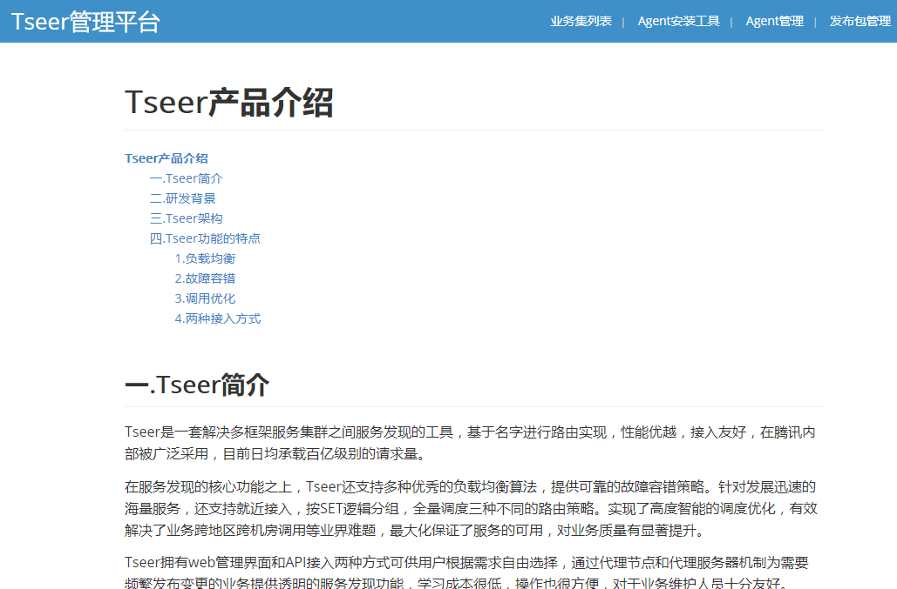

# TSeer 构建指引

## 1. 执行命令构建镜像
```
docker build -t tseer:v1.0
```
构建名为tseer，tag为v1.0的镜像

## 2. 创建容器
```
docker run --name tseer --privileged -p 12345:22 -p 8080:8080 tseer:v1.0 /usr/sbin/init
```
创建名为tseer的容器，并且开放端口为22和8080

## 3. 进入容器
有2种方法：
①宿主机上直接执行
```
docker exec -ti tseer bash
```
②通过宿主机ip使用ssh登录，密码为1
```
ssh root@${宿主机ip} 12345
```

## 4. 启动tseer服务
```
/sbin/tseer_start.sh
```

## 5. 打开TSeer页面开始体验
浏览器上输入
```
http://${宿主机ip}:8080
```


## 6. TSeerAgent或者API访问TSeerServer服务
①同是一台宿主机内的容器或者网络可通设备，可直接访问

②只跟宿主机网络通的设备，则可：

    1.在步骤2，使用-p 开放9902 9903 9904 9765端口
    
    2.宿主机配置防火墙nat策略

## 7. 已经构建好的镜像
```
https://hub.docker.com/r/yuansx/tseer
```
